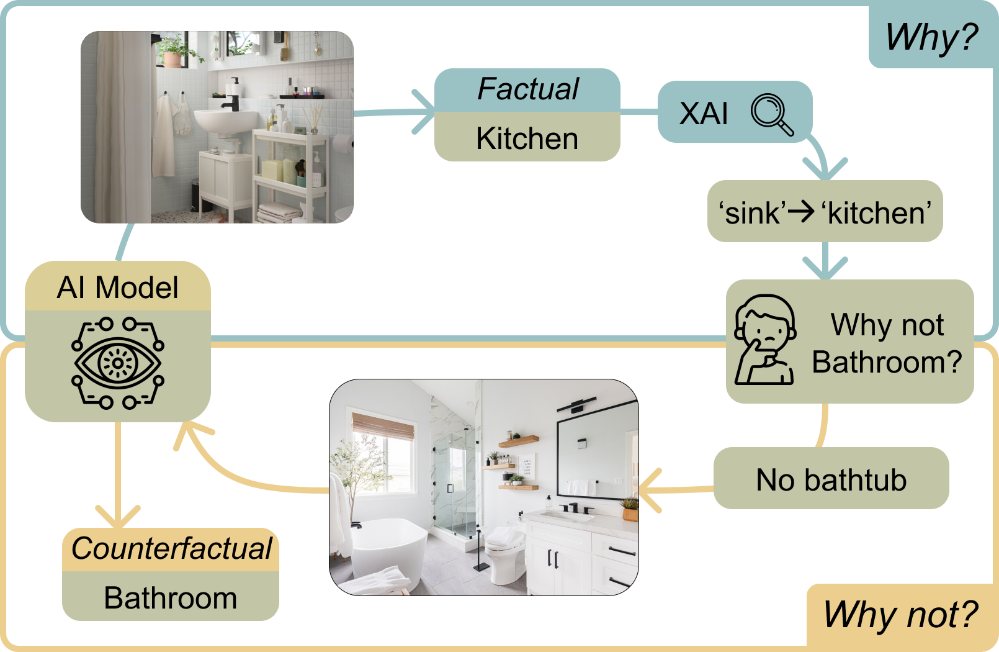

# CHIME: Causal Human-In-the-Loop Model Explanations

**Authors**: Shreyan Biswas, Lorenzo Corti, Stefan Buijsman, and Jie Yang

- [Introduction](#introduction)
- [Keywords](#keywords)
- [Data](#data)
- [Dependencies](#dependencies)
  - [Data Collection Application](#data-collection-application)
  - [Python Packages for Analyses](#python-packages-for-analyses)
- [Referencing this work](#referencing-this-work)

## Introduction

Explaining the behaviour of Artificial Intelligence models has become a necessity. Their opaqueness and fragility are not tolerable in high-stakes domains especially. Although considerable progress is being made in the field of Explainable Artificial Intelligence, scholars have demonstrated limits and flaws of existing approaches: explanations requiring further interpretation, non-standardised explanatory format, and overall fragility. In light of this fragmentation, we turn to the field of philosophy of science to understand what constitutes a good explanation, that is, a generalisation that covers both the actual outcome and, possibly multiple, counterfactual outcomes. In this work led by Shreyan, we propose CHIME: a human-in-the-loop, post-hoc approach focused on creating such explanations by establishing the causal features in the input. We first elicit people's cognitive abilities to understand what parts of the input the model might be attending to. Then, through Causal Discovery we uncover the underlying causal graph relating the different concepts. Finally, with such a structure, we compute the causal effects different concepts have towards a model's outcome. We evaluate the Fidelity, Coherence, and Accuracy of the explanations obtained with CHIME with respect to two state-of-the-art Computer Vision models trained on real-world image data sets. We found evidence that the explanations reflect the causal concepts tied to a model's prediction, both in terms of causal strength and accuracy. We think exploring the intersection between Explainable AI and Causal Inference is beneficial to build better explanation methods.

## Keywords
Explainable AI, Human-In-the-Loop, Causal Inference

## Data
The `data` folder include the processed data as a result of our experiments. The folder is organised based on the analyses and the biases we injected in the Computer Vision models.

*Please refer to the paper for the details on these.*

| Folder         | Contents |
|----------------|----------|
|`processed_data`| For every image, objects and their properties as annotated by crowd workers. |
|`causal_verification`| Results from Causal Verification. |
|`coherence`| Results from Coherence evaluation of the explanations. |
|`effects_graphs_mediation`| Results from Mediation analysis. |

## Dependencies

### Data Collection Application
The data collection application used in conjunction with [Prolific](https://www.prolific.co/) was deployed using Docker. In this repository we include the `docker-compose` files to run it.

The application was developed with
- Python backend through Django; a specific `requirements.txt` file is included
- Angular frontend
- Elasticsearch as storage space

### Python Packages for Analyses
The `requirements.txt` file included at the root level of this repository includes the necessary dependencies to re-run our experiments.

## Referencing this work

Any scientific publications that use our codes and datasets should cite the following paper as the reference:

~~~~
@article{Biswas_Corti_Buijsman_Yang_2022,
    title={CHIME: Causal Human-in-the-Loop Model Explanations},
    volume={10},
    url={https://ojs.aaai.org/index.php/HCOMP/article/view/21985},
    DOI={10.1609/hcomp.v10i1.21985},
    abstractNote={Explaining the behaviour of Artificial Intelligence models has become a necessity. Their opaqueness and fragility are not tolerable in high-stakes domains especially. Although considerable progress is being made in the field of Explainable Artificial Intelligence, scholars have demonstrated limits and flaws of existing approaches: explanations requiring further interpretation, non-standardised explanatory format, and overall fragility. In light of this fragmentation, we turn to the field of philosophy of science to understand what constitutes a good explanation, that is, a generalisation that covers both the actual outcome and, possibly multiple, counterfactual outcomes. Inspired by this, we propose CHIME: a human-in-the-loop, post-hoc approach focused on creating such explanations by establishing the causal features in the input. We first elicit people’s cognitive abilities to understand what parts of the input the model might be attending to. Then, through Causal Discovery we uncover the underlying causal graph relating the different concepts. Finally, with such a structure, we compute the causal effects different concepts have towards a model’s outcome. We evaluate the Fidelity, Coherence, and Accuracy of the explanations obtained with CHIME with respect to two state-of-the-art Computer Vision models trained on real-world image data sets. We found evidence that the explanations reflect the causal concepts tied to a model’s prediction, both in terms of causal strength and accuracy.},
    number={1},
    journal={Proceedings of the AAAI Conference on Human Computation and Crowdsourcing},
    author={Biswas, Shreyan and Corti, Lorenzo and Buijsman, Stefan and Yang, Jie},
    year={2022},
    month={Oct.},
    pages={27-39}
}
~~~~

Nobody guarantees the correctness of the data, its suitability for any particular purpose, or the validity of results based on the use of the data set. The data set may be used for any research purposes under the following conditions:

- The user must acknowledge the use of the data set in publications resulting from the use of the data set.
- The user may not redistribute the data without separate permission.
- The user may not try to deanonymise the data.
- The user may not use this information for any commercial or revenue-bearing purposes without first obtaining permission from the authors.